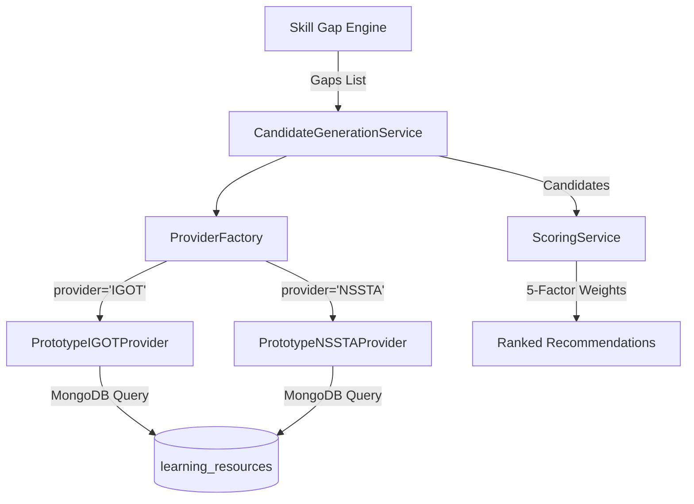

# PHASE 3A — iGOT Karmayogi Ecosystem Integration Audit

> **Status**: READ-ONLY AUDIT COMPLETE  
> **Date**: August 31, 2026  
> **Platform**: ShikshaSetu (Smart India Hackathon)  
> **Directive**: Rigorous inspection of existing learning resources, recommendations, learning activities, NSSTA, authentication, and database schemas prior to code modification.

---

## 1. Existing iGOT-Related Implementation

### A. Data & Seed Models
- **Catalog Dataset**: `backend/app/scripts/seed_learning_resources.py` parses and seeds **63 curated iGOT courses** from `igot_courses_enriched.csv` into MongoDB's `learning_resources` collection.
- **Provider Flag**: Every resource contains `provider: "IGOT"` and `resource_type: "COURSE"`.
- **Provider-Specific Metadata**:
  ```python
  class ProviderSpecific(BaseModel):
      course_id: Optional[str] = None       # e.g., "do_113884879201"
      programme_id: Optional[str] = None    # NULL for iGOT (used for NSSTA)
      course_url: Optional[str] = None      # https://igotkarmayogi.gov.in/...
      provider_name: Optional[str] = None   # "iGOT Karmayogi"
      extraction_note: Optional[str] = None
  ```
- **Competency Mappings**: `resource_mappings` collection links iGOT course IDs to 42 National Competency Framework codes (e.g., `TECH_PYTHON`, `STAT_SAMPLING`, `BEHAV_ETHICS`) with explicit confidence ratings (`0.85` verified or `0.60-0.75` derived).

### B. Existing Provider Code
- **Location**: `backend/app/learning_resources/provider.py`
- **Class**: `PrototypeIGOTProvider(LearningResourceProvider)`
- **Behavior**: Queries local MongoDB `learning_resources` collection for `provider == "IGOT"` and fetches associated confidence scores from `resource_mappings`.
- **Live Integration State**: **No live HTTP client, OAuth2 token exchange, or external webhook listener currently exists.**

---

## 2. Existing Learning-Resource Architecture



- **Unified Collection**: Single `learning_resources` collection storing both iGOT courses and NSSTA programmes.
- **Factory Pattern**: `ProviderFactory.get_provider("IGOT", db)` instantiates the provider abstraction.
- **Scoring Engine**: `backend/app/learning_resources/scoring.py` evaluates candidates using a deterministic 5-factor formula:
  1. **Competency Match (35%)**: Direct alignment with identified skill deficit.
  2. **Gap Priority (25%)**: Urgency (Critical = 1.0, High = 0.75, Medium = 0.5, Low = 0.25).
  3. **Level Appropriateness (20%)**: Difference between course difficulty and user's current competency level.
  4. **Role Relevance (10%)**: Domain alignment with user's designation.
  5. **Source Verification (10%)**: Verification status (`VERIFIED` vs `TENTATIVE`).

---

## 3. Existing NSSTA Architecture

- **Catalog Dataset**: 80 training programmes + 5 MoSPI training courses from `nssta_training_programmes.csv` and `SRC-05` (National Statistical Systems Training Academy calendar).
- **Provider Flag**: `provider: "NSSTA"`, `resource_type: "TRAINING_PROGRAMME"`.
- **Provider Class**: `PrototypeNSSTAProvider(LearningResourceProvider)` in `backend/app/learning_resources/provider.py`.
- **Verification Status**: Marked as `VERIFIED` (for calendar-anchored courses) or `TENTATIVE` (for derived statistical modules).

---

## 4. Recommendation-Engine Integration Points

- **API Endpoint**: `GET /api/v1/recommendations/me` (`backend/app/learning_resources/router.py`)
- **Service Orchestrator**: `RecommendationService.get_recommendations_for_user(user_id)`
  1. Calls `app.skill_gaps.service.calculate_skill_gaps(db, user_id)`.
  2. Forwards gaps to `CandidateGenerationService`.
  3. Evaluates all candidates across iGOT and NSSTA.
  4. Returns ranked list with detailed `score_breakdown` and explainability text.
- **Frontend Consumer**: [OfficialRecommendations.tsx](file:///c:/Users/Lenovo/Desktop/ShikshaSetu/frontend/client/src/pages/official/OfficialRecommendations.tsx)
  - Features provider filter buttons: `All`, `iGOT`, `NSSTA`.
  - Explanatory drawer: "Why was this recommended?".
  - Direct Action: "Start Learning" and external launch button.

---

## 5. Learning-Activity Integration Points

- **Endpoints**:
  - `POST /api/v1/learning-activities` (`start_learning_activity`)
  - `PATCH /api/v1/learning-activities/{id}` (`update_learning_activity`)
  - `POST /api/v1/learning-activities/{id}/complete` (`complete_learning_activity`)
  - `GET /api/v1/learning-activities/user/{user_id}` (`list_user_activities`)

### ⚠️ Non-Negotiable Governance Invariant:
```text
Learning Activity Completed (iGOT / NSSTA)
      ↓
Writes to competency_evidence collection:
  - type: "LEARNING_ACTIVITY"
  - score: progress / completion score
  - confidence: 0.30 (Supporting Evidence)
      ↓
Competency Profile (current_level): UNCHANGED
Skill Gap: UNCHANGED
      ↓
User must complete Formal Capability Assessment (AI Quiz / Proctored Exam):
      ↓
Writes to competency_evidence collection:
  - type: "CAPABILITY_ASSESSMENT"
  - confidence: 0.85 (Authoritative Evidence)
      ↓
Competency Profile UPDATED ➔ Skill Gap RECALCULATED
```
**Audit Confirmation**: `backend/app/learning_activities/service.py` lines 103–175 strictly enforce this rule. Learning completion does NOT modify `competency_profiles.current_level`.

---

## 6. Required iGOT API Capabilities (Real Ecosystem Specification)

If official Karmayogi Bharat API credentials and documentation were supplied, the following endpoints would be needed:

| Capability | Karmayogi API Signature (Ideal) | Purpose |
| :--- | :--- | :--- |
| **Catalog Sync** | `GET /api/v1/courses/search?competency={code}` | Fetch live course updates & new modules |
| **User SSO / Linking** | `POST /api/v1/auth/karmayogi-token` | Map civil service Parichay/JanParichay ID to iGOT UUID |
| **Course Enrollment** | `POST /api/v1/courses/{course_id}/enroll` | Trigger official enrollment on Karmayogi platform |
| **Progress Webhook** | `POST /webhooks/igot/progress` | Receive xAPI / SCORM telemetry statements |
| **Completion Verification**| `GET /api/v1/users/{id}/certificates/{course_id}` | Cryptographically verify Karmayogi completion |

---

## 7. What Can Genuinely Be Implemented Now

1. **Normalized iGOT Ecosystem Adapter Architecture**:
   - Create `IGOTAdapter` interface and `MockIGOTProvider` / `PrototypeIGOTProvider`.
   - Provide clean abstraction layer ready to plug in live credentials when issued.
2. **Transparent Platform Status Badge**:
   - Prominently display system integration state in UI:
     > **"Live iGOT Synchronization: Prototype Mode (Pending Official API Gateway Credentials)"**
3. **Curriculum Deep-Linking**:
   - Provide direct external links to legitimate iGOT Karmayogi course pages (`https://igotkarmayogi.gov.in/`).
4. **Learning Activity Simulated Telemetry**:
   - Track self-paced progress (0% ➔ 100%) and duration within ShikshaSetu.
   - Record immutable supporting evidence in `competency_evidence` (confidence `0.30`).
5. **Admin Ecosystem Configuration & Diagnostics**:
   - Admin page for viewing iGOT sync status, catalog freshness, and provider connection health.

---

## 8. What Requires Official iGOT API Access

- Real-time bi-directional enrollment sync without user leaving the app.
- Automated server-to-server progress tracking from Diksha/Sunbird/Karmayogi backend.
- Official Karmayogi digital certificates and verifiable credentials (W3C VC format).

---

## 9. Proposed Integration Architecture

```text
backend/app/igot/
├── __init__.py
├── adapter.py          <-- Abstract base adapter interface (sync, enroll, verify)
├── prototype_adapter.py<-- Prototype/Mock adapter using curated Karmayogi catalog
├── live_adapter.py     <-- Production adapter (activated when API keys provided)
├── router.py           <-- /api/v1/igot endpoints (status, catalog, sync)
├── schemas.py          <-- Pydantic request/response models
└── service.py          <-- Ecosystem service coordinating adapters & learning activities
```

---

## 10. Security & Configuration Requirements

Add the following optional variables to `backend/.env` and `app/core/config.py`:
- `IGOT_INTEGRATION_MODE`: `"prototype"` (default) or `"live"`
- `IGOT_API_BASE_URL`: `""`
- `IGOT_CLIENT_ID`: `""`
- `IGOT_CLIENT_SECRET`: `""`
- `IGOT_WEBHOOK_SECRET`: `""`

---

## 11. Migration Risks & Safety

| Risk | Mitigation |
| :--- | :--- |
| **Breaking 148 seeded learning resources** | All existing database collections and IDs remain 100% untouched. |
| **Modifying 5-factor recommendation formula** | Scoring algorithm remains pure and deterministic. |
| **Breaking competency governance** | Learning completion strictly generates `0.30` Supporting Evidence; competency profiles remain unedited. |
| **Backend test regressions** | Ensure full 254+ backend unit test suite continues to pass with 0 failures. |

---

## 12. Exact Implementation Plan for Phase 3A

1. **Step 1 — Backend iGOT Module (`backend/app/igot/`)**:
   - Implement `IGOTAdapter` base class and `PrototypeIGOTAdapter`.
   - Implement `LiveIGOTAdapter` with clean fallback on missing credentials.
   - Implement `/api/v1/igot/status` and `/api/v1/igot/courses` endpoints.
2. **Step 2 — Backend Unit Tests**:
   - Add test suite in `backend/tests/test_igot.py` covering adapter fallback, ecosystem status, and RBAC.
3. **Step 3 — Frontend API Client Harmonization**:
   - Extend `api.igot.*` in `frontend/client/src/lib/api.ts`.
4. **Step 4 — UI Ecosystem Indicators**:
   - Update `OfficialRecommendations.tsx`, `OfficialLearning.tsx`, and `AdminDashboard.tsx` with clear live/prototype status notices.
5. **Step 5 — Verification & Push**:
   - Run backend pytest (254+ tests), frontend typecheck/build, commit, and push.
