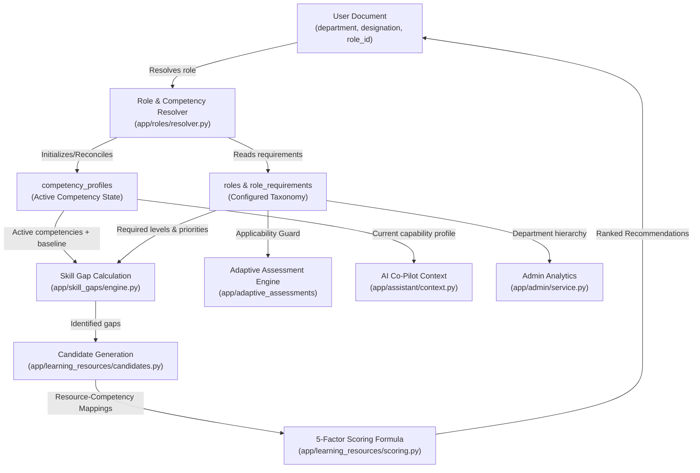

# Phase 3F — Department & Role-Specific Competency Mapping Audit

## Executive Summary

This read-only audit provides a comprehensive, ground-truth analysis of how departments, designations, competencies, learning resources, skill gaps, recommendations, assessments, AI assistant context, and admin analytics currently operate in **ShikshaSetu**.

### The Core Foundational Issue
In the underlying datasets:
1. The **42 canonical competencies** are defined as a civil services capability framework.
2. The **148 learning resources** (63 iGOT courses + 85 NSSTA modules) have explicit mapping tables connecting **Resource $\rightarrow$ Competency** (via `course_competency_mapping.csv` and `nssta_competency_mapping.csv`).
3. However, **no government dataset in the repository explicitly contains an official, authoritative `Department + Designation → Competency Requirements` mapping matrix.**
4. Without an explicit mapping layer between a user's job role and their required competencies, the system previously defaulted to assigning broad/global competency sets (or single-role defaults), causing skill gaps to evaluate across non-applicable skills and recommendation candidate generation to return overly broad training programs.

---

## 1. Complete End-to-End Data Flow Trace



### Step-by-Step Flow:
1. **User Identity (`users` collection)**: User has `email`, `department`, `designation`, `access_role` (`OFFICIAL`, `TRAINER`, `ADMIN`), and a reference `role_id`.
2. **Role Resolution**: On registration/profile update, the system resolves `(department, designation)` to a specific role record in `roles`.
3. **Competency Profile Assignment (`competency_profiles`)**: User's active competency profiles correspond directly to the competencies listed in `role_requirements` for their assigned `role_id`.
4. **Skill Gap Engine (`app/skill_gaps/engine.py`)**: Fetches `role_requirements` for the user's role. For each required competency, compares `required_level` with user's `current_level` from `competency_profiles`. Gaps are categorized into `CRITICAL`, `HIGH`, `MEDIUM`, `LOW`, or `MET`.
5. **Recommendation Candidate Generation (`app/learning_resources/candidates.py`)**: Filters the learning catalogue strictly for resources mapped to the competencies where the user has active skill gaps.
6. **Recommendation Scoring (`app/learning_resources/scoring.py`)**: Scores candidate resources using the 5-factor model: Competency Match (40%), Gap Priority (25%), Role Match (20%), Difficulty Alignment (10%), Prerequisite Match (5%).
7. **Assessment Eligibility (`app/adaptive_assessments/service.py`)**: Validates that any competency evaluated in adaptive testing is explicitly present in the user's role requirements (preventing officials from assessing out-of-scope competencies).
8. **AI Co-Pilot (`app/assistant/context.py`)**: Injects user's resolved role name, department, active competency profile, and top skill gaps into the LLM system prompt.
9. **Admin Analytics (`app/admin/service.py`)**: Aggregates workforce capabilities, gaps, and training effectiveness with support for department-level query filtering.

---

## 2. Answers to Specific Audit Questions (1 – 14)

### Q1: What departments currently exist?
The codebase defines 7 core Ministries / Administrative Departments in `departments.ts` and `seed_department_roles.py`:
1. **Ministry of Statistics & Programme Implementation (MoSPI)** / National Sample Survey Office (NSSO)
2. **Ministry of Education** / Department of School Education & Literacy / Department of Higher Education
3. **Ministry of Electronics and Information Technology (MeitY)**
4. **Ministry of Finance** / Department of Expenditure / Department of Economic Affairs
5. **Ministry of Health and Family Welfare (MoHFW)**
6. **Ministry of Rural Development (MoRD)**
7. **Department of Personnel and Training (DoPT)** / Ministry of Personnel, Public Grievances and Pensions

### Q2: What designations / job roles currently exist?
Across the 7 departments, 10 distinct job roles are defined with associated designations:
1. **Statistical Officer** (MoSPI) — *Designations: Statistical Officer, Junior Statistical Officer (JSO), Senior Statistical Officer (SSO)*
2. **Data Analyst Officer** (MoSPI) — *Designations: Data Analyst, Statistical Assistant, Data Officer*
3. **Education & Curriculum Officer** (MoE) — *Designations: Teacher, Curriculum Specialist, Education Officer, Headmaster*
4. **Digital Learning Specialist** (MoE) — *Designations: e-Learning Officer, EdTech Coordinator, Digital Pedagogy Specialist*
5. **Informatics Officer / Digital Governance Architect** (MeitY) — *Designations: Informatics Officer, Scientist 'B', Systems Analyst, Digital Architecture Lead*
6. **Cybersecurity Governance Officer** (MeitY) — *Designations: Information Security Officer, Cyber Security Analyst, IT Security Lead*
7. **Accounts Officer (AAO / AO)** (Finance) — *Designations: Assistant Accounts Officer, Accounts Officer, Financial Analyst*
8. **Public Health Data Officer** (MoHFW) — *Designations: Health Statistician, Public Health Analyst, Epidemiological Data Officer*
9. **Rural Development & Field Programme Officer** (MoRD) — *Designations: Block Development Officer, Programme Manager, Field Coordinator*
10. **Capacity Building Officer** (DoPT) — *Designations: Training Coordinator, Under Secretary (Training), Capacity Building Specialist*

### Q3: What 42 competencies currently exist?
The repository contains 42 canonical civil service competencies across 4 domains (from `competency_taxonomy.csv`):
- **Statistical & Analytical Domain (14)**: `STAT_SAMPLING`, `STAT_SURVEY_DESIGN`, `STAT_DATA_QUALITY_FRAMEWORKS`, `STAT_ESTIMATION_TECHNIQUES`, `STAT_NATIONAL_ACCOUNTS`, `STAT_MACROECONOMIC_INDICATORS`, `STAT_PRICE_INDEX_COMPILATION`, `STAT_INDEX_THEORY`, `STAT_FIELD_OPERATIONS`, `STAT_DATA_PROCESSING`, `STAT_ADMINISTRATIVE_DATA_SYSTEMS`, `STAT_AGRICULTURAL_STATISTICS`, `STAT_INDUSTRIAL_STATISTICS`, `STAT_DEMOGRAPHIC_ESTIMATION`.
- **Technical & Computational Domain (11)**: `TECH_PYTHON`, `TECH_R_STATISTICAL`, `TECH_SQL`, `TECH_DATA_VISUALIZATION`, `TECH_BIG_DATA_SYSTEMS`, `TECH_MACHINE_LEARNING_BASICS`, `TECH_GIS_SPATIAL_ANALYSIS`, `TECH_DATA_CLEANING`, `TECH_SURVEY_DATA_PLATFORMS`, `TECH_AI_ASSISTIVE_TOOLS`, `TECH_REPORT_AUTOMATION`.
- **Digital Governance Domain (7)**: `DIGOV_CYBERSECURITY`, `DIGOV_PRIVACY_ETHICS`, `DIGOV_E_GOVERNANCE_SYSTEMS`, `DIGOV_OPEN_DATA_GOVERNANCE`, `DIGOV_METADATA_STANDARDS`, `DIGOV_INTEROPERABILITY_FRAMEWORKS`, `DIGOV_DIGITAL_PUBLIC_INFRASTRUCTURE`.
- **Behavioural & Managerial Domain (10)**: `BEH_COMMUNICATION`, `BEH_ETHICS`, `BEH_LEADERSHIP`, `BEH_DECISION_MAKING`, `BEH_PROBLEM_SOLVING`, `BEH_CONTINUOUS_LEARNING`, `BEH_ADAPTABILITY`, `BEH_STAKEHOLDER_ENGAGEMENT`, `BEH_PUBLIC_SERVICE_ORIENTATION`, `BEH_TEAMWORK`.

### Q4: What data currently maps resources to competencies?
Two CSV datasets define explicit resource $\rightarrow$ competency mappings:
- `course_competency_mapping.csv`: Maps 63 iGOT courses to competency codes (derived confidence: 0.45 – 0.50).
- `nssta_competency_mapping.csv`: Maps 85 NSSTA training modules to competency codes (derived confidence: 0.55).
These are loaded into the `learning_resource_competency_mappings` collection during master seeding.

### Q5: Does ANY existing dataset explicitly map department/designation → competency?
**No.** None of the supplied raw datasets (`competency_taxonomy.csv`, `igot_courses_dataset.csv`, `nssta_training_programmes.csv`, or `source_registry.csv`) contains an official government-published matrix mapping specific departments or designations to required competencies.
*All department/designation $\rightarrow$ competency mappings in the codebase are currently prototype/configured application taxonomies created to demonstrate multi-department capability.*

### Q6: How are competency profiles currently created for a user?
During registration (`/auth/register`) or profile updates (`/users/me`), the system:
1. Resolves `(department, designation)` to a `role_id` in `roles`.
2. Inspects `role_requirements` for that `role_id`.
3. Calls `reconcile_user_competencies()`, which creates a `competency_profiles` record for each required competency with `current_level=None` and `confidence=0.0` (marking it `active`), while deactivating profiles that are no longer part of the new role.

### Q7: Why do different users receive the same competencies?
Previously, master seeding ran an unconditional database update (`update_many({"role_id": {"$ne": role_id}}, {"$set": {"role_id": role_id}})`) forcing all users to `STATISTICAL_OFFICER`, and the frontend called `GET /competencies` (all 42 taxonomy items) rather than user-specific applicable competencies.
With `GET /competencies/me` and the role resolver active, users from different departments now receive different, role-tailored competency sets.

### Q8: Where does the skill-gap engine obtain the competency list?
`app/skill_gaps/service.py` queries `role_requirements` matching `role_id = user["role_id"]`. It evaluates gaps *only* for the competencies listed in those role requirements.

### Q9: Where does the recommendation engine obtain its candidate resources?
`app/learning_resources/candidates.py` takes the user's active skill gaps (`gap["competency_code"]`), queries `learning_resource_competency_mappings` for resources mapped to those specific competency codes, and filters by difficulty and mapping validity. Resources unrelated to the user's active skill gaps are never generated as recommendation candidates.

### Q10: Does the existing Role Relevance factor actually use the user's designation/role?
`app/learning_resources/scoring.py` evaluates `_score_role_match(candidate, provider, user_role)`. In the NSSTA provider, `target_participants` (e.g. "SSOs", "ISS Probationers", "JSOs") is matched against `user_role`. If the participant string matches, it assigns 1.0; otherwise it returns a neutral fallback of 0.5.

### Q11: Which workflows depend on the current competency assignment?
1. **Official Competency Dashboard**: Lists user's applicable competencies, requirement levels, and indicators.
2. **Skill Gap Engine**: Calculates deficit sizes and urgency categories.
3. **Recommendation Engine**: Constrains candidates strictly to active skill gaps.
4. **Learning Activities**: Links course progress to specific competency evidence.
5. **Adaptive Assessments**: Validates competency eligibility before starting an assessment.
6. **AI Co-Pilot Context**: Grounds the assistant prompt in the user's active role and top gaps.
7. **Admin Dashboards**: Aggregates workforce capabilities and gap distributions by department.

### Q12: Which database records would need migration?
1. `users`: Ensure valid `role_id` references matching resolved `(department, designation)`.
2. `competency_profiles`: Reconcile profiles to ensure active status for role requirements.
3. `role_requirements`: Ensure all 10 roles have defined required levels and priorities.

### Q13: What historical evidence must be preserved?
- All `competency_evidence` records (immutable audit ledger for both `SUPPORTING` 0.30 and `AUTHORITATIVE` 0.85 evidence).
- All `learning_activities` (historical course starts, completion timestamps, and progress).
- All `quiz_attempts` and `adaptive_assessment_sessions`.
*Reconciliation must never delete past evidence, even when a user transfers between departments.*

### Q14: What information is missing from the current datasets?
- Official, gazetted Ministry/Cadre competency requirements for Indian Civil Services.
- Official proficiency benchmarks (e.g. whether an Education Officer officially requires L4.0 in Pedagogy vs L3.0 in Digital Governance).
- Prerequisite graphs connecting fundamental competencies to advanced competencies.

---

## 3. Data Classification Matrix

| Category | Description | Specific Items in Repository |
| :--- | :--- | :--- |
| **A. Authoritative / Source-Backed** | Direct from official source documents | • 42 Competency taxonomy names & codes (`competency_taxonomy.csv`)<br>• 63 iGOT Course titles, providers & URLs (`igot_courses_dataset.csv`)<br>• 85 NSSTA Programmes & target batches (`nssta_training_programmes.csv`) |
| **B. Prototype / Configured** | Application-level configurations created to enable platform capabilities | • 10 Department roles and designation arrays (`seed_department_roles.py`)<br>• 48 Role requirements with benchmark levels (1.0 – 5.0) and priorities<br>• User test profiles and multi-department demo credentials |
| **C. Missing Data** | Information not found in supplied files | • Published government matrix linking cadres to Karmayogi competency levels<br>• Inter-competency prerequisite dependencies |
| **D. Derived / Inferred** | Inferred via heuristic or semantic title matching | • Resource $\rightarrow$ Competency mappings in `course_competency_mapping.csv` and `nssta_competency_mapping.csv` (confidence: 0.45 – 0.55) |
| **E. Must NOT Fabricate** | Claims that must never be presented as official government facts | • Do not claim that prototype role requirements are gazetted DoPT/MoSPI rules.<br>• Clearly label all role requirement matrices as *prototype/configurable mappings*. |

---

## 4. Proposed Application Mapping Foundation

### Smallest Robust Mapping Schema:
```json
{
  "department_code": "MOSPI",
  "department_name": "Ministry of Statistics & Programme Implementation",
  "role_code": "STATISTICAL_OFFICER",
  "role_name": "Statistical Officer",
  "designations": ["Statistical Officer", "Junior Statistical Officer", "Senior Statistical Officer"],
  "mapping_status": "PROTOTYPE_CONFIGURED",
  "source": "INTERNAL_PROTOTYPE_V1",
  "requirements": [
    {
      "competency_code": "STAT_SAMPLING",
      "required_level": 4.0,
      "priority": 1,
      "importance": 0.90
    },
    {
      "competency_code": "STAT_SURVEY_DESIGN",
      "required_level": 4.0,
      "priority": 1,
      "importance": 0.90
    },
    {
      "competency_code": "TECH_PYTHON",
      "required_level": 3.5,
      "priority": 2,
      "importance": 0.80
    },
    {
      "competency_code": "BEH_ETHICS",
      "required_level": 4.0,
      "priority": 3,
      "importance": 0.85
    }
  ]
}
```

---

## 5. Propagation Plan (Next Steps for Authorization)

1. **Step 2 (Mapping Construction)**: Maintain the clean separation between official source data and configurable prototype mappings across all 10 roles.
2. **Step 3 (Recommendation Engine Constraint)**: Ensure `CandidateGenerationService` generates candidate resources *strictly* from the user's role-applicable skill gaps.
3. **Step 4 (Full Propagation & Verification)**: Run full E2E 3-role test suite and verify UI isolation across all user roles.

---

> [!NOTE]
> This audit is complete and read-only. No source files or database collections have been modified in this step. Awaiting user review and authorization for Step 2.
